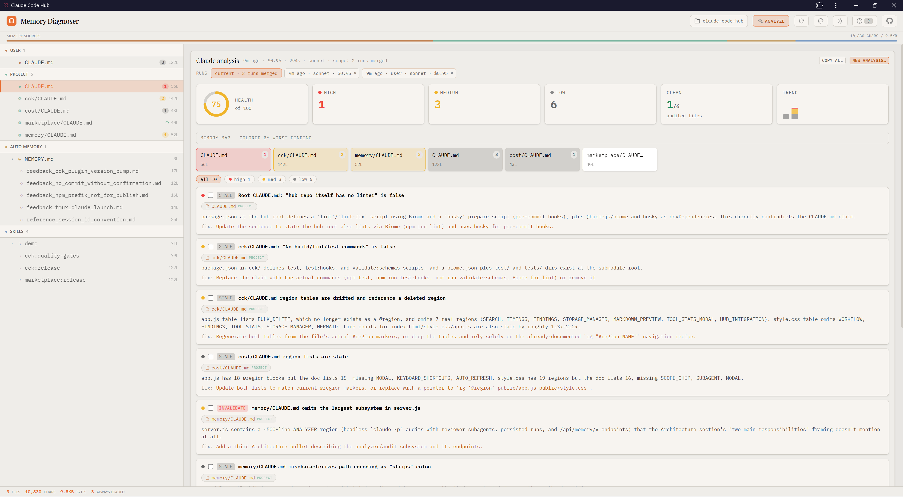

# Claude Code Memory Diagnoser

[](https://www.npmjs.com/package/claude-code-memory-explorer)
[](LICENSE)
[](https://www.npmjs.com/package/claude-code-memory-explorer)

**[Live Demo & Docs](https://nikiforovall.blog/claude-code-memory/)**

> See everything Claude Code knows about your project — and find what's stale, false, or conflicting.



## Getting Started

```bash
npx claude-code-memory-explorer --open
```

No config. The dashboard scans the Claude Code memory locations for the current project and renders the full stack. Browsing is read-only; nothing leaves your machine.

## Features

- **Full memory stack** — user/project/local CLAUDE.md, rules, auto memory, agent memory, managed policies, and resolved `@import` chains in one view
- **Claude analysis** — audit memory files with headless Claude: health score, per-file findings (stale, false, or conflicting claims) with suggested fixes, merged across runs
- **Keyboard-driven** — j/k navigation, e to open in editor, Shift+P project picker, ? for help
- **17 color themes** — each in light and dark, PWA installable
- **Hub integration** — runs standalone or as a tab in [Claude Code Hub](https://github.com/NikiforovAll/claude-code-hub)

## Configuration

```
PORT=8080                Custom port (default: 3544, falls back if busy)
--dir <path>             Custom Claude config dir (default: ~/.claude)
--project <path>         Project to inspect (default: current directory)
--open                   Open browser on start
```

The config dir can also be set via the `CLAUDE_CONFIG_DIR` environment variable. Switch projects at runtime with the picker (Shift+P) or `?project=/path`.

## License

MIT
