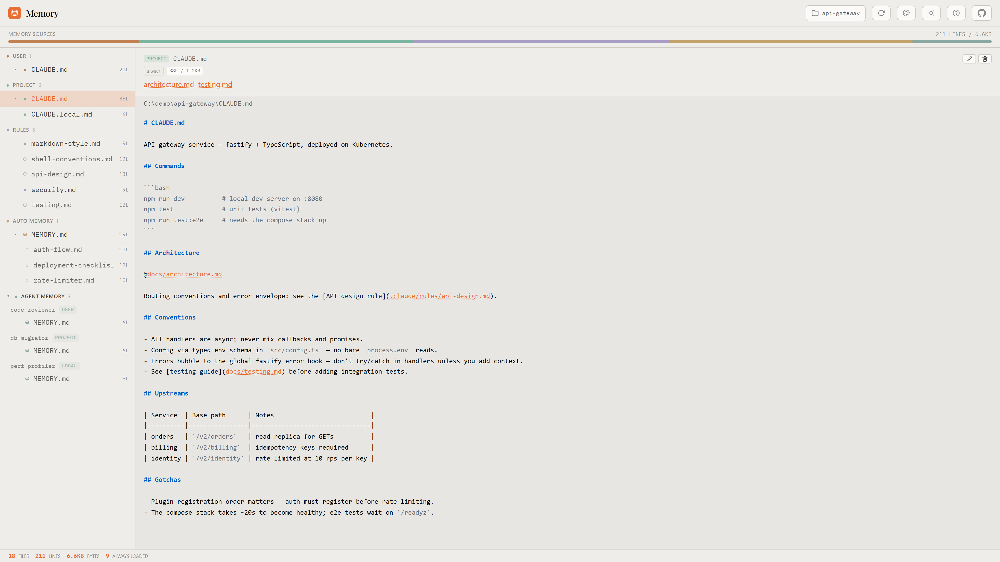
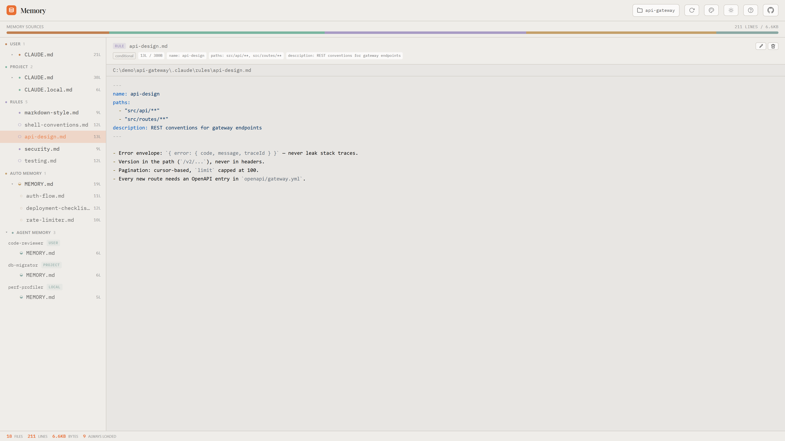
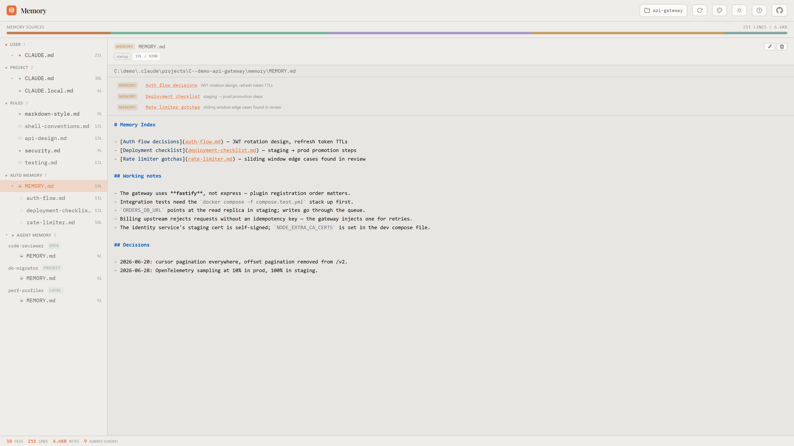
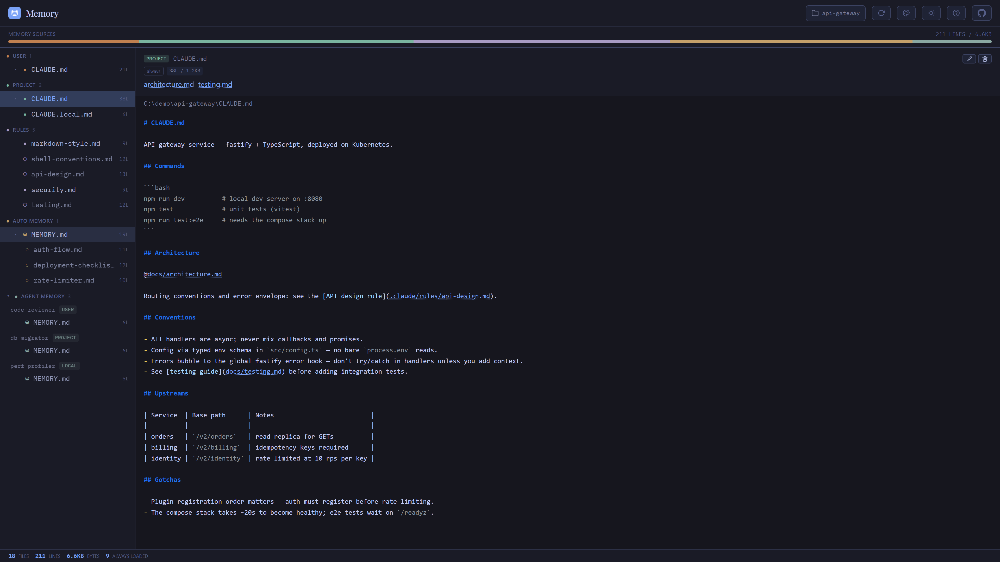

# Claude Code Memory

[](https://www.npmjs.com/package/claude-code-memory-explorer)
[](LICENSE)
[](https://www.npmjs.com/package/claude-code-memory-explorer)

**[Live Demo & Docs](https://nikiforovall.blog/claude-code-memory/)**

> See everything Claude Code knows about your project — CLAUDE.md files, rules, auto memory, agent memory, and imports.



## Getting Started

```bash
npx claude-code-memory-explorer --open
```

That's it — no config. The dashboard scans the Claude Code memory locations for the current project and renders the full stack. Completely read-only; nothing leaves your machine.

## Features

- **Full memory stack** — user CLAUDE.md, project CLAUDE.md, CLAUDE.local.md, rules, auto memory, agent memory, and managed policies in one view
- **Import resolution** — follows `@path/to/file.md` references and `[text](file.md)` markdown links up to 5 levels deep, clickable in the preview
- **Rules inspection** — path-scoped frontmatter (`paths`, `type`, `name`) with conditional load indicators
- **Auto memory** — MEMORY.md with startup badge, on-demand topic files, and frontmatter badges
- **Agent memory** — subagent persistent memory at user, project, and local scope, grouped per agent
- **Keyboard-driven** — j/k navigation, h/l group jump, e to open in editor, Shift+P project picker, ? for help
- **17 color themes** — Ember, Gruvbox, Catppuccin, Tokyo Night, Dracula, Nord, and more — each in light and dark, PWA installable
- **Hub integration** — runs standalone or as a tab in [Claude Code Hub](https://github.com/NikiforovAll/claude-code-hub) alongside Kanban, Cost, and Marketplace







## Configuration

```
PORT=8080                Custom port (default: 3544, falls back if busy)
--dir <path>             Custom Claude config dir (default: ~/.claude)
--project <path>         Project to inspect (default: current directory)
--open                   Open browser on start
```

The config dir can also be set via the `CLAUDE_CONFIG_DIR` environment variable. Switch projects at runtime with the picker (Shift+P) or `?project=/path`.

## License

MIT
