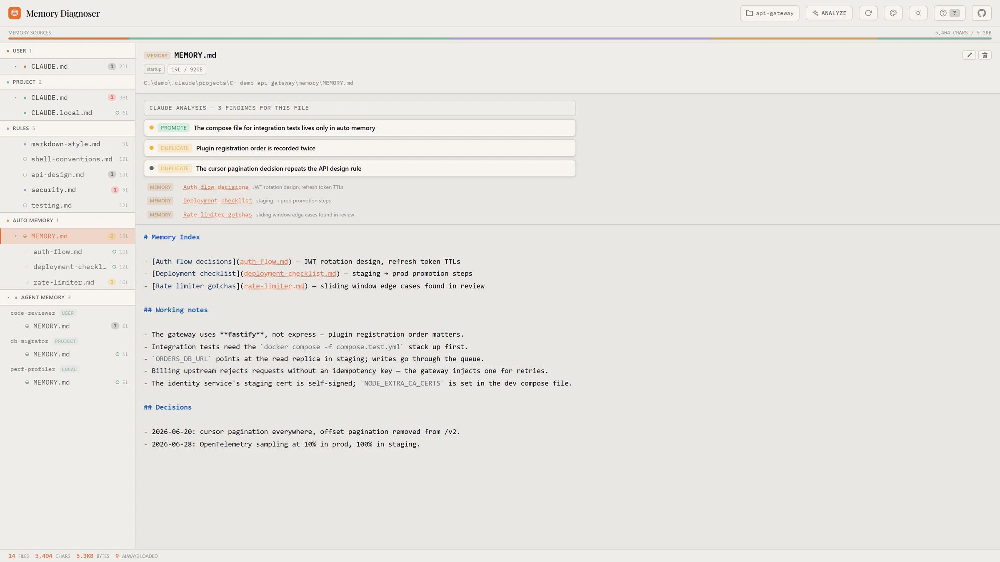
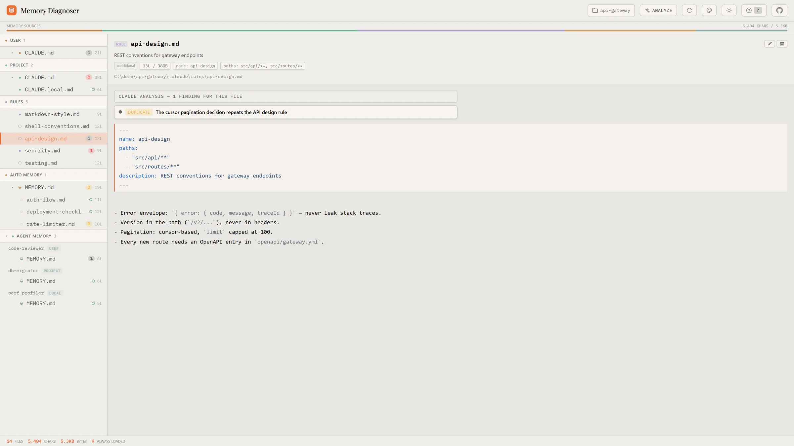

# Claude Code Memory Diagnoser

[](https://www.npmjs.com/package/claude-code-memory-explorer)
[](LICENSE)
[](https://www.npmjs.com/package/claude-code-memory-explorer)

See every memory file that Claude Code loads for a project, and let Claude find what is stale, false, or in conflict.

**[Documentation](https://nikiforovall.blog/claude-code-memory/)**

<picture>
  <source media="(prefers-color-scheme: dark)" srcset="website/public/shots/themes/ember-h3-hub-memory-dark.webp">
  
</picture>

## Getting started

You need Node.js 20 or later. Open a terminal in your project directory and run:

```bash
npx claude-code-memory-explorer --open
```

The app scans the memory files for the current directory and opens the page in your browser. The default port is 3544. You do not need a config file. Browsing changes nothing on disk.

To run an analysis, you also need Claude Code, installed and logged in. See [Getting started](https://nikiforovall.blog/claude-code-memory/getting-started/).

## Features

- **Full memory stack.** Managed policy, user and project `CLAUDE.md` files (including `CLAUDE.local.md` and nested files in subdirectories), user and project rules, project skills, auto memory, agent memory, and the files they import or link, in one tree. See [What Claude Code loads](https://nikiforovall.blog/claude-code-memory/guides/memory-stack/).
- **Load types.** Each file shows when Claude Code loads it: always, startup, conditional, on-demand, tree, import, or link.
- **Memory footprint.** A bar and summary cards show the files, characters, and bytes that can load in each session, split by scope. The app does not estimate tokens.
- **Rules with paths.** A rule with `paths` in its frontmatter shows as conditional, with its globs as badges in the file view.
- **Auto memory and agent memory.** A `MEMORY.md` index shows as a table of its linked notes, with a mark at the 200-line startup cutoff. A cleanup button removes index lines that point to missing files.
- **Analyze with Claude.** Runs `claude -p` on your machine with one reviewer subagent per file. Reviewers check each claim against your repository. You get a health score, findings such as duplicates, contradictions, and stale facts, and a suggested fix for each. Copy one finding as a prompt, or several as a fix plan. Each run shows its cost. See [Analyze memory with Claude](https://nikiforovall.blog/claude-code-memory/guides/analyze/).
- **Keyboard-driven.** <kbd>↓</kbd> <kbd>↑</kbd> or <kbd>j</kbd> <kbd>k</kbd> move through the tree, <kbd>e</kbd> opens the file in your editor, <kbd>Shift</kbd>+<kbd>P</kbd> switches the project, and <kbd>?</kbd> shows all keys. See [Keyboard shortcuts](https://nikiforovall.blog/claude-code-memory/reference/shortcuts/).
- **17 color themes**, each in light and dark. The app installs as a progressive web app.
- **Claude Code Hub.** Runs on its own or as a tab in [Claude Code Hub](https://github.com/NikiforovAll/claude-code-hub), with project and theme sync. See [Run inside Claude Code Hub](https://nikiforovall.blog/claude-code-memory/reference/hub/).

<picture>
  <source media="(prefers-color-scheme: dark)" srcset="website/public/shots/themes/ember-memory-analysis-dark.webp">
  
</picture>

<picture>
  <source media="(prefers-color-scheme: dark)" srcset="website/public/shots/themes/ember-h3c-hub-memory-auto-memory-dark.webp">
  
</picture>

<picture>
  <source media="(prefers-color-scheme: dark)" srcset="website/public/shots/themes/ember-h3d-hub-memory-rule-dark.webp">
  
</picture>

## Configuration

| Flag | What it does | Default |
| --- | --- | --- |
| `--port <n>` | Port to listen on. If the port is busy, the app uses a random free port and prints it. | `PORT`, else `3544` |
| `--open` | Opens the page in your browser after start. | Off |
| `--dir <path>` | Claude config dir to read. | `CLAUDE_CONFIG_DIR`, else `CLAUDE_DIR`, else `~/.claude` |
| `--project <path>` | Project the server starts on. | The current directory |
| `--host <addr>` | Address to bind. | `HOST`, else `127.0.0.1` |
| `--allowed-hosts <list>` | Comma-separated extra `Host` header values to accept. | `ALLOWED_HOSTS`, else none |

The app has no authentication. Bind a non-loopback address only on a network you trust.

To look at a different project, use the project picker (<kbd>Shift</kbd>+<kbd>P</kbd>) or add `?project=/path` to the URL. The pencil button and <kbd>e</kbd> run the editor in `EDITOR`, or `code` when it is not set. Analyze saves its runs in `<config dir>/memory-analysis/`.

For all options and the files the app reads and writes, see [CLI and configuration](https://nikiforovall.blog/claude-code-memory/reference/configuration/). For common problems, see [Troubleshooting](https://nikiforovall.blog/claude-code-memory/reference/troubleshooting/).

## License

MIT
